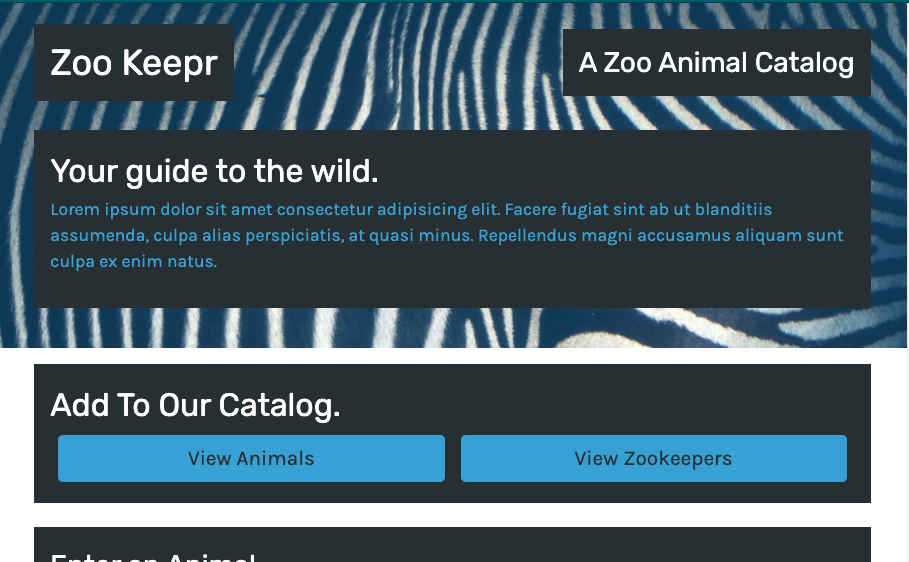

<h1 align="center">Zookeepr</h1>
  

    
    
    

  

## Description 

Animal logger where a user can search for Animals and Zookeepers. A user can also input new animals and Zookeepers. 

## Link to Deployed Application on Heroku
[Zookeepr](https://protected-forest-60443.herokuapp.com/)

## Technologies

- Express
- Heroku 
- Node.js
- Jest.js

## Installation
1. Fork the repo
2. Navigate to root folder, then type `npm i` to download all of the dependencies.
3. To start the application, type `npm start` 

